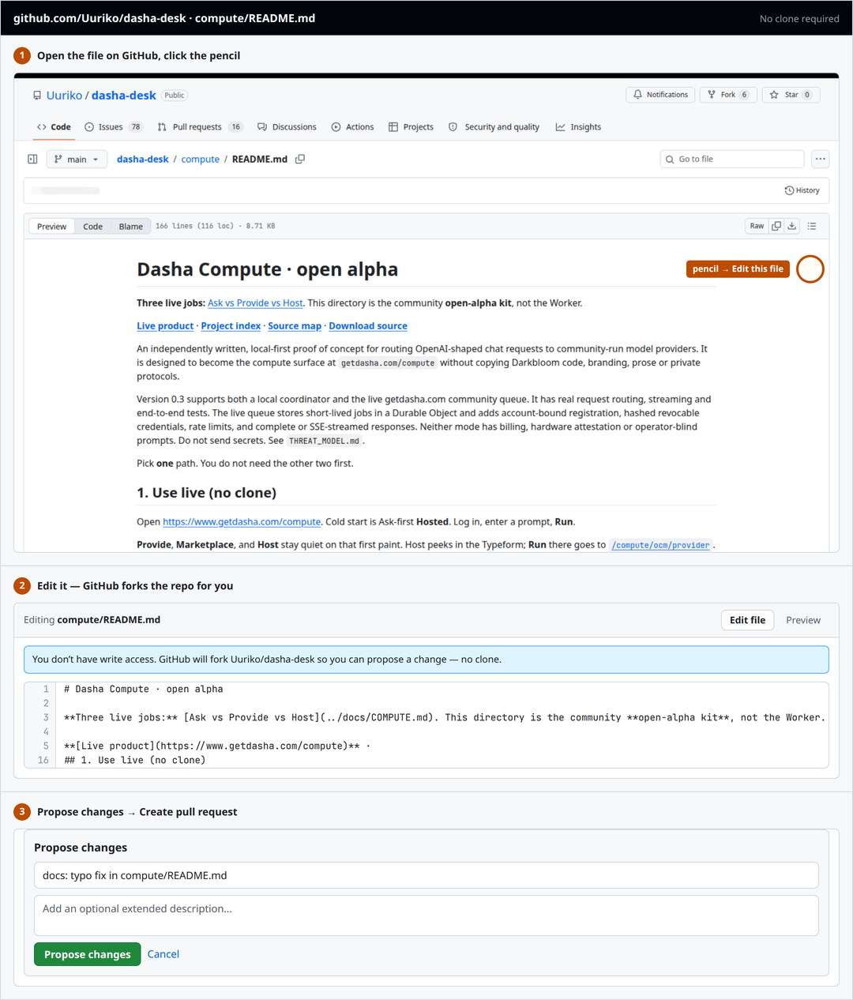

# Contributing

This guide is for **open-source project contributors** (code, docs, ideas on GitHub).
It is not a payment, airdrop, bag check, or paid program.

There is nothing to join. Open a pull request and you are a contributor — no invite, no org access,
no application. Holder status and Board points are **never** required to contribute.

**Product context:** [Ask](https://www.getdasha.com/compute) · [Host](https://www.getdasha.com/compute/ocm/provider) · [Marketplace](https://www.getdasha.com/compute/ocm) · live buy [getdasha.com/how-to-buy](https://www.getdasha.com/how-to-buy)

**Live path (no clone):** open [Ask](https://www.getdasha.com/compute) → Log in → Run (Hosted). Provide a Mac from the same page, or [Host via OCM](https://www.getdasha.com/compute/ocm/provider) on Apple Silicon. Studio is local / Pages only; www `/studio` 308s home.

**Start here:** [good first issues](https://github.com/Uuriko/dasha-desk/contribute) (Compute + docs first) · [Ideas welcome](https://github.com/Uuriko/dasha-desk/issues/7) · [Discussions](https://github.com/Uuriko/dasha-desk/discussions)

**Maintainer:** [@Uuriko](https://github.com/Uuriko) reviews and merges.

## Response expectations

We aim to **first-reply to issues and pull requests within 7 days** (often faster). Security reports follow [SECURITY.md](SECURITY.md). If you have been waiting longer, leave a polite ping on the thread.

## No setup needed

For a typo, wording, a dead link, or any doc change, you never have to leave the browser:

1. Open the file on GitHub, click the **pencil**.
2. Edit it — GitHub forks the repo for you.
3. **Propose changes** → **Create pull request**.



*Editing [`compute/README.md`](https://github.com/Uuriko/dasha-desk/blob/main/compute/README.md) on GitHub.com. No clone required.*

No clone, no Node, no build.

## Claim a good first issue

1. Open [github.com/Uuriko/dasha-desk/contribute](https://github.com/Uuriko/dasha-desk/contribute).
2. Comment **“I’d like to take this”** (or similar).
3. If someone else already claimed it recently, pick another issue or ask on the thread.
4. Open a PR within about **two weeks** that references the issue (`Closes #N`). If you drop it, leave a note so someone else can pick up.

If you get stuck, comment with what you tried. Mentorship is welcome — ask early rather than disappearing.

## Evidence-first contributions

A pull request must implement the repository's actual contract, not an imagined product described in plausible prose.

Before writing code:

- Read the full issue and every linked blocker, predecessor PR, schema, and decision note that defines the scope.
- Inspect the current repository. Do not assume an Anchor program, escrow account, API route, SDK method, webhook format, database, deployment, or partner integration exists because it would be convenient.
- Verify every external interface against current official documentation, a pinned official SDK, or captured fixtures shaped from a reviewed real response. Do not invent endpoints, test hosts, headers, status values, program IDs, or partner approval.
- If an issue says work is blocked pending a product, custody, authority, or settlement decision, do not bypass that decision with a simulation or local mock and call the issue complete.
- A design document, pseudocode block, or generated “implementation solution” is not implementation. Add the actual files, tests, and reproducible evidence requested by the issue.

For wallet, payment, settlement, custody, deployment, and external-provider work:

- Reuse the repository's canonical validators, schemas, and state machine instead of creating a looser parallel model.
- Bind financial facts to the exact chain, mint, amount, source, destination, purpose, transaction, status, slot, commitment, and observation source required by the current contract.
- Treat a wallet-returned signature as submitted, not funded or paid. Ambiguous outcomes must enter reconciliation before retry.
- Keep unit tests local and deterministic. No real funds, production credentials, or live deployment side effects belong in ordinary CI.
- State what is simulated, captured, test-mode, devnet, externally observed, or production. Do not blur those categories.

In the pull request, include:

- the exact issue and acceptance criteria addressed;
- the official external references or pinned fixtures used;
- the commands you ran and their actual result;
- the final commit tested;
- remaining limitations and unverified claims;
- a narrow explanation of why the change does not weaken custody, signing, identity, privacy, or deployment boundaries.

AI coding tools and agents are welcome, but the human submitter remains responsible for inspecting the repository, verifying external facts, running the tests, and correcting fabricated assumptions. Automated claim-and-submit systems do not receive special review priority. Repeated submissions that invent infrastructure, paste hypothetical solutions, or falsely close issues may be closed without another full review.

## Make a code change

1. Branch from `main`.
2. Edit **`src/`** (or docs / `studio/` / `bounties/` / `compute/` / `ocm/` as relevant). Do **not** hand-edit generated `index.html`, `dist/`, or `src/app.html`.
3. Regenerate and check:

   ```bash
   node build.mjs --write
   npm ci
   npm test
   ```

4. Open a pull request that says what changed and how it was checked.

Good first contributions are Compute + docs: Ask / Provide / Host copy, the open-alpha quickstart in [`compute/README.md`](compute/README.md), STATUS (live www vs experimental), and the GitHub web-edit screenshot. Keyboard, screen-reader, dead-link, and provider-diagnostic work still counts. Compute changes must preserve its explicit alpha and privacy limitations. Studio looks stay a local-only exercise — they do not ship on www.

For a larger idea, [open an issue](https://github.com/Uuriko/dasha-desk/issues/new/choose) or post in [Discussions](https://github.com/Uuriko/dasha-desk/discussions) with the smallest useful first slice — crypto infra, consumer UX, or creative tools are all fair game.

## Prepared Simp Points lane

This lane is not active yet, so no current pull request earns Simp Points. Once activated, qualifying
merged work can be recognized on the public [Simp Board](https://www.getdasha.com/simp):

| Label | Points |
|---|---:|
| `impact:tiny` | 5 |
| `impact:small` | 15 |
| `impact:medium` | 40 |
| `impact:large` | 100 |
| `impact:critical` | 200 |

A PR can score only after activation when it is merged, is not a draft, targets an allowed base
branch, and has an approving review from **someone other than its author**. The maintainer applies
exactly one `impact:` label to the PR before merge; the issue label previews the intended size, but
the scorer reads the PR label. Contributors do not need label permissions. Bot accounts are rejected. There are caps — per
season, per rolling seven days, and on total points per season — so the board measures contribution
rather than volume, and so nobody can farm it by splitting one change into twenty.

**Points are recognition and nothing else.** They are not a payment, not a token allocation, not an
airdrop, not a claim on anything, and not a statement about anyone's worth. They are a number next to
a name on a public page. If you want the change more than the number, you have understood it
correctly. You do **not** need points (or a Board account) to open a PR.

The prepared scoring rules live in `dasha-simp-oss-scorer.mjs` in the operator's repo and are covered
by tests. Activation, season dates and any qualifying awards will be stated here before points begin.

## Guardrails

- No price predictions, targets, returns, or urgency.
- No fabricated holders, volume, endorsements, or quotes.
- No implied endorsement by a real person or use of their likeness to promote the token.
- No custody of funds or keys.
- Record rights before adding third-party media.
- Report security-sensitive findings privately through [SECURITY.md](SECURITY.md).

Be kind, attribute sources, and never commit secrets.
