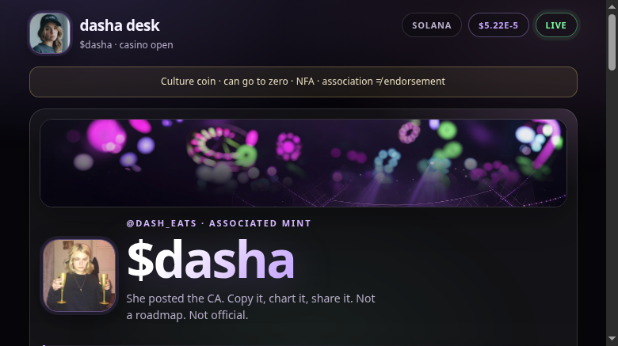

# dasha desk

**Unofficial, open-source mint desk for `$dasha` on Solana.**

Static webapp: candidate mint evidence · @dash_eats quotes · live Dex numbers · CA comparison · share pack · buy/chart links.

No backend. No wallet connect. No fake roadmap.

## Trust and status

| Boundary | Current state |
|---|---|
| Maturity | Early alpha; no independent security audit |
| Deployment | No verified public build; the Webflow and Catbox copies are legacy/unhardened, `getdasha.com` is not connected, and GitHub Pages is disabled |
| Accounts and custody | No account, server, wallet connection, signing request or custody; outbound buy links leave this site |
| Evidence | Embedded hashes detect changed bytes only; they do not prove authorship, endorsement, safety, publication time or inclusion in Solana consensus |
| Market data | Exact-pair Dexscreener observations can be stale, unavailable or wrong; they are not a price oracle or recommendation |
| Incentives | Unofficial promotional desk; operator position and compensation are not disclosed |
| Supported source | Latest commit on `main`; private vulnerability reporting is documented in [`SECURITY.md`](SECURITY.md) |



| | |
|--|--|
| **Repo** | https://github.com/Uuriko/dasha-desk |
| **Legacy Webflow copy** | https://johns-awesome-project-39b1b5.webflow.io/dasha — **unhardened; do not use as the verified build** |
| **Pages (pending)** | https://uuriko.github.io/dasha-desk/ — currently unavailable |
| **Legacy Catbox copy** | https://files.catbox.moe/sm5mo0.html — **unhardened; do not use** |
| **Mint** | `53uxQtB9pcjWvCHguz3JTTndvuKqGxhrD37EetnCpump` |

## Quick start

Requires Node.js 24 or newer. The site has no package dependencies, so no install step is needed.

```bash
git clone https://github.com/Uuriko/dasha-desk.git
cd dasha-desk
npm test
python3 -m http.server 8766
# → http://127.0.0.1:8766/
```

## Features

| Feature | Description |
|---------|-------------|
| **Mint** | Associated CA, one-click copy, QR |
| **Quotes** | Short @dash_eats lines (public posts) |
| **Numbers** | Price / mcap / liq / vol from Dexscreener public API |
| **Checker** | Paste any mint → match / no match |
| **Evidence** | RPC-reported SPL Mint facts, absent authorities, reproducible account-data digest, and labeled association source |
| **Share** | Copy pack + draft on X |
| **Rails** | Jupiter, Dex, Solscan, Birdeye, Rugcheck, Phantom |

## Source and build

Canonical sources: [`src/body.html`](src/body.html), [`src/styles.css`](src/styles.css), [`src/app.js`](src/app.js), and [`config/dasha.json`](config/dasha.json).

```bash
npm run build         # regenerate Webflow embed, standalone and single-file build
npm test              # the deterministic, offline contributor and CI gate
npm run evidence:live # opt-in network check against finalized Solana account bytes
node launch-check.mjs --prelaunch # warning-only report before domain cutover
node launch-check.mjs --launch    # strict production readiness
```

Generated surfaces: [`src/app.html`](src/app.html) for Webflow, [`index.html`](index.html) for normal hosting, and [`dist/index.html`](dist/index.html) for single-file hosting.

The CI workflow runs the same build-drift and behavior checks on every pull request before deployment can run.

The live evidence check is intentionally local rather than a CI dependency. It makes one finalized `getAccountInfo` request (override with `DASHA_SOLANA_RPC_URL`), performs no writes, and reports only unchanged bytes, field-level drift, or an operational error. One RPC response is not an inclusion proof, safety verdict, identity claim, or independent corroboration.

## Runtime boundaries

| Provider | Used for | Failure behavior |
|---|---|---|
| Dexscreener API | price, liquidity, volume and chart URL | page stays usable and labels market data offline |
| X, Dexscreener CDN and Catbox | attributed media | broken images collapse to an unavailable placeholder |

Third-party data and media are not endorsements. Provider-supplied chart and image URLs are accepted only from their exact HTTPS Dexscreener hosts; otherwise the canonical links remain unchanged.

## Research

X scrape for landing voice/media: [`docs/X-RESEARCH-DASHA-2026-08-06.md`](docs/X-RESEARCH-DASHA-2026-08-06.md).

## Deploy

See [`docs/DEPLOY.md`](docs/DEPLOY.md).

**GitHub Pages:** workflow prepared; repository Pages is not yet enabled and currently returns 404.
**Webflow:** embed `src/app.html` inline — do not iframe third-party hosts that send `X-Frame-Options: DENY`.

## License

[MIT](LICENSE) for project code and original documentation. Bundled media is **not automatically MIT-licensed**; see [`assets/ATTRIBUTION.md`](assets/ATTRIBUTION.md) for per-source terms and unresolved redistribution boundaries.

**Not included:** claiming official endorsement by Dasha Nekrasova, Red Scare, or @dash_eats. Quotes are public posts for the `$dasha` instance.

## Disclaimer

Culture coins can go to zero. This software is not financial, legal, or tax advice. Always verify mints independently.

## Product

**dasha desk** — open-source mint desk product. `$dasha` is the flagship config.

Security-sensitive mistakes—wrong mint, substituted links, hostile provider data, or impersonation—belong in the private reporting path described in [`SECURITY.md`](SECURITY.md), not a public issue with exploit details.
