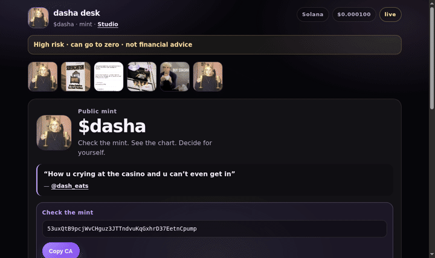

# dasha

Open-source tools for `$dasha` on Solana — static, honest, remixable. Three of them live here.

**[studio/](studio/)** — the Meme Studio: procedural looks, local uploads, a registered Dasha image
gallery, three formats, PNG and animated GIF out. No account or wallet.
[Use it ↗](https://www.getdasha.com/studio)

**the desk** (this directory) — check the mint against independent explorers, then one neutral
Jupiter route. [Use it ↗](https://www.getdasha.com/dasha)

**[bounties/](bounties/)** — dasha bounties / the board: hunt a paid GitHub issue or list a
project with your own rules. Machine-readable feed at
[getdasha.com/bounties/feed.json](https://www.getdasha.com/bounties/feed.json). The page may also
show public Demigod listings, marked as such. Declared bounties, not escrow.
[Use it ↗](https://www.getdasha.com/bounties/)

None of them connects a wallet or moves anything. Original drawings are public domain. Uploaded or
externally sourced images keep their own rights.

[GitHub Pages demo](https://uuriko.github.io/dasha-desk/) · [Website](https://www.getdasha.com) · [Site: open source](https://www.getdasha.com/#oss)



## Start contributing (open-source project)

This is **code and docs contribution** to the public MIT repo — not a payment, bag check, or paid program. Open a pull request and you are a project contributor. No invite. **Maintainer:** [@Uuriko](https://github.com/Uuriko).

**From getdasha.com:** the homepage **Work on open source ↗** / **Open source ↗** buttons land on [good first issues](https://github.com/Uuriko/dasha-desk/contribute).

**Fastest path (no clone):**

1. Open **[good first issues](https://github.com/Uuriko/dasha-desk/contribute)** (GitHub’s `/contribute` page).
2. Or fix a typo in the browser: open a file → pencil → **Propose changes** → PR.
3. Full guide: [CONTRIBUTING.md](CONTRIBUTING.md) (we aim to first-reply within **7 days**).

Also: [Ideas welcome (#7)](https://github.com/Uuriko/dasha-desk/issues/7) · [Discussions](https://github.com/Uuriko/dasha-desk/discussions) · [open an idea or bug](https://github.com/Uuriko/dasha-desk/issues/new/choose) · [ROADMAP.md](docs/ROADMAP.md)

Merged pull requests score points on the public [Simp Board](https://www.getdasha.com/#simp), sized by
the issue's `impact:` label — [how that works](CONTRIBUTING.md#what-the-impact-labels-mean). Points are
recognition on a page, not a payment or a token allocation. You never need points to open a PR.

CI runs the complete build, mint, share, docs, and browser-resilience gate on every PR.

## What it does

- keeps the associated mint visible and easy to copy
- checks pasted addresses against that mint
- remembers **last check on this device** (local only) and warns if the mint string changes
- shows public market data with clear offline fallbacks
- links explorers, chart, and one neutral Jupiter route
- ships as static HTML, CSS, and JavaScript (no wallet connect)

**Roadmap is community input** — open an issue and propose what to build next (infra, consumer, creative). Adding a new Studio look is the most self-contained change here; [studio/README.md](studio/README.md) walks through it.

## Run it

```bash
git clone https://github.com/Uuriko/dasha-desk.git
cd dasha-desk
python3 -m http.server 8766
# → http://127.0.0.1:8766/
# → http://127.0.0.1:8766/bounties/
# → http://127.0.0.1:8766/studio/
```

After changing sources:

```bash
node build.mjs --write
npm ci
npm test
```

The site itself has no install step or runtime dependencies. Tests use one development-only package
and an installed Chrome/Chromium browser so the failure paths run in a real page.

Runtime sources: [`src/body.html`](src/body.html) · [`src/styles.css`](src/styles.css) · [`src/app.js`](src/app.js) · [`config/dasha.json`](config/dasha.json) · [`bounties/`](bounties/) · [`studio/`](studio/)

`src/app.html`, `index.html`, and `dist/index.html` are **generated** — do not edit by hand.

## Trust

No wallet, no custody, no price promises. Third-party data can fail; mint and source paths stay usable. Association with public culture is **not endorsement**.

[MIT](LICENSE) for code · [asset attribution](assets/ATTRIBUTION.md) for media · [Code of conduct](CODE_OF_CONDUCT.md)
